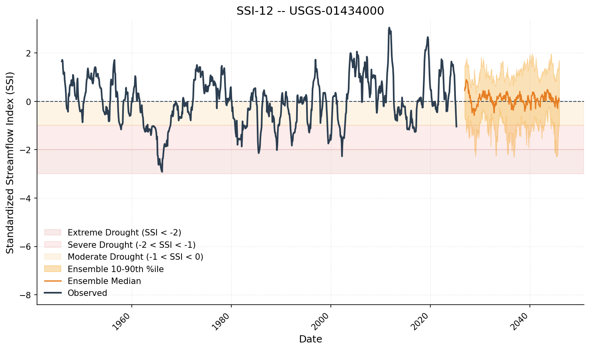

# Drought Analysis with SSI

SynHydro provides the **Standardized Streamflow Index (SSI)** for
characterizing drought from streamflow data. This tutorial covers the
SSI calculation and drought event extraction workflow.

## Calculate SSI on observed data

SSI transforms raw flows into standardized anomalies by fitting a probability
distribution within a rolling window. Values below -1 indicate drought;
below -2 is extreme.

```python
import synhydro

Q_daily = synhydro.load_example_data()
Q_monthly = Q_daily.resample("MS").sum()
site = Q_monthly.columns[0]

ssi_calc = synhydro.SSI(dist="gamma", timescale=12, fit_freq="ME")
ssi_calc.fit(Q_monthly[site])
ssi = ssi_calc.get_training_ssi()

print(f"SSI mean: {ssi.mean():.3f}")   # ~0
print(f"SSI std:  {ssi.std():.3f}")     # ~1
```

## Extract drought events

`get_drought_metrics` identifies contiguous periods where SSI stays below -1:

```python
metrics = synhydro.get_drought_metrics(ssi)
print(metrics[["start", "end", "duration", "severity", "avg_severity"]].head())
```

Each row is a drought event with its duration, severity (minimum SSI),
and magnitude (cumulative deficit).

## Visualize ensemble SSI

`plot_ssi_timeseries` computes SSI for each ensemble realization and overlays
the observed SSI, making it easy to compare synthetic and historical drought
behavior. Pass the ensemble (not a training SSI series) along with the
observed flows.

```python
from synhydro.plotting import plot_ssi_timeseries

gen = synhydro.KirschGenerator()
gen.fit(Q_monthly)
ensemble = gen.generate(n_realizations=20, n_years=20, seed=42)

fig, ax = plot_ssi_timeseries(
    ensemble,
    observed=Q_monthly[site],
    site=site,
    window=12,
    title=f"SSI-12 -- {site}",
)
```

{: width="700px" }

Shaded zones mark moderate (-1 to -1.5), severe (-1.5 to -2), and
extreme (< -2) drought conditions.

!!! tip "Choosing a distribution"
    Use `compare_distributions` to rank candidate distributions by AIC and
    Kolmogorov-Smirnov test:
    ```python
    results = synhydro.compare_distributions(Q_monthly[site].dropna().values)
    print(results)
    ```

## Next steps

- **Ensemble validation** - [Tutorial 05](05_validation.md)
- **Algorithm details** - [Kirsch Bootstrap](../algorithms/kirsch.md)

---

**Previous:** [Monthly-to-Daily Pipeline](03_pipeline.md) | **Next:** [Ensemble Validation](05_validation.md)
