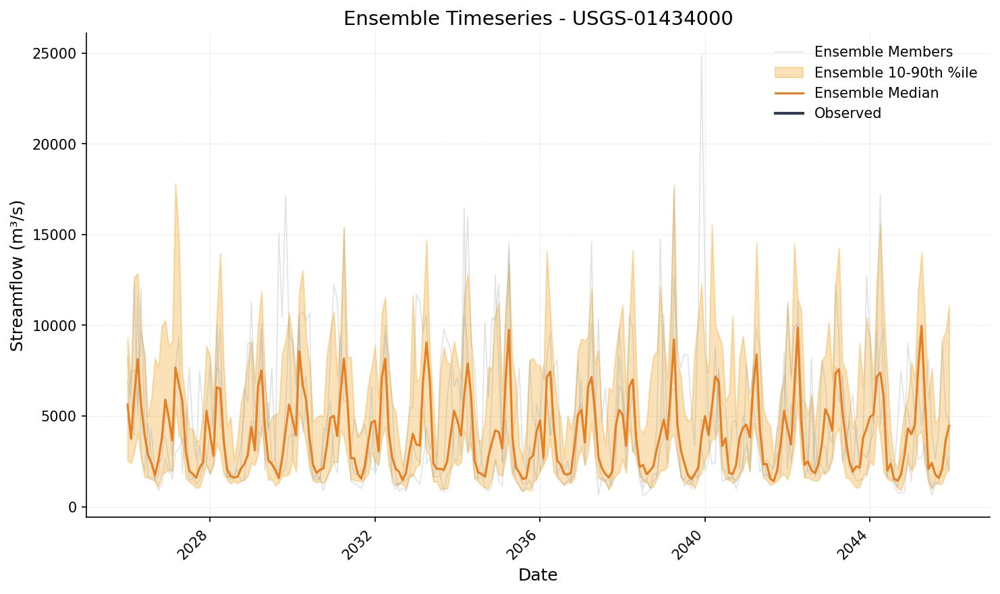
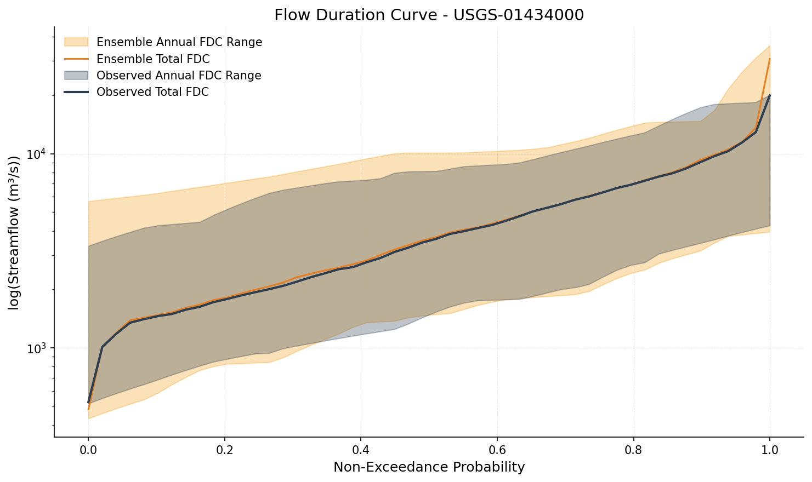
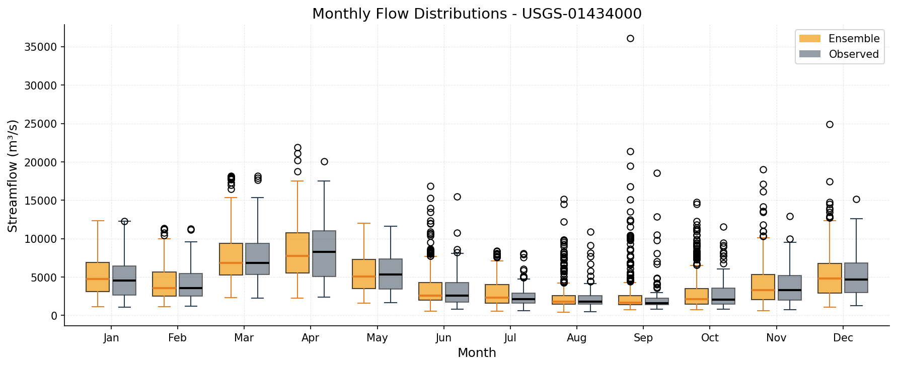
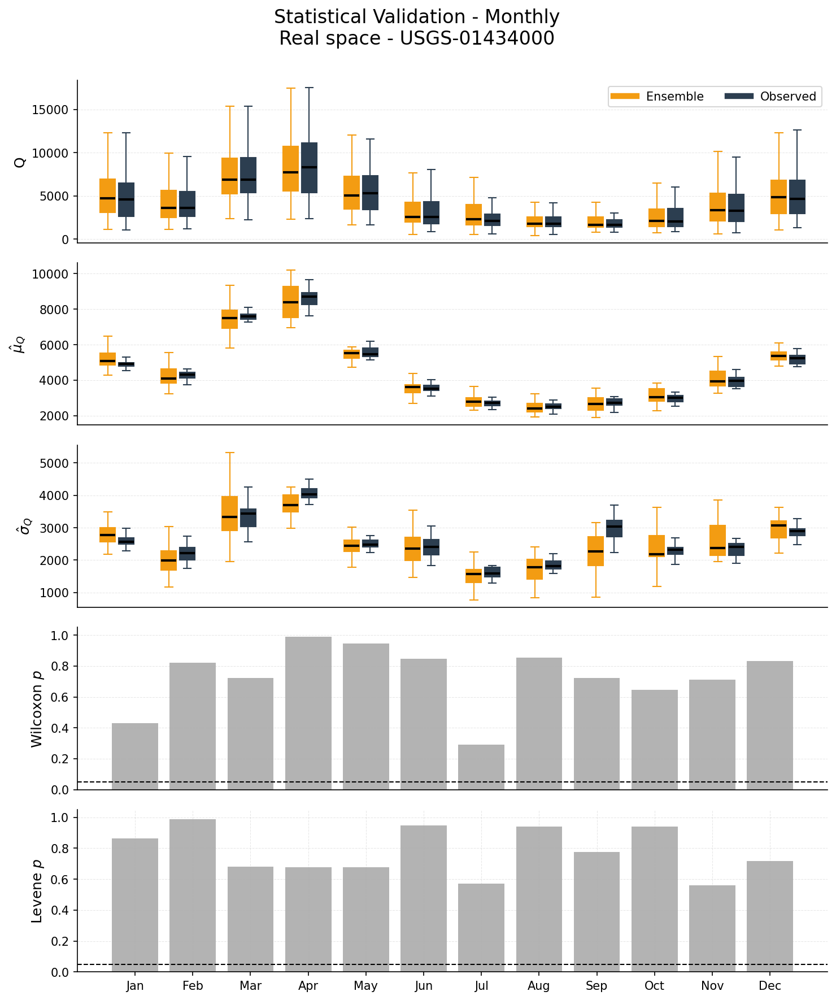

# Plotting Walkthrough

This tutorial walks through the standard plotting tools you'll use after
generating a synthetic ensemble. The `synhydro.plotting` module provides
ensemble-aware versions of the common diagnostic figures (timeseries with
percentile bands, flow duration curves, monthly distributions, and a
multi-panel validation summary), all sharing a consistent argument style.

For the full list of plotting functions and their arguments see the
[Plotting API reference](../api/plotting.md).

## Setup

Generate a small Kirsch ensemble that we can re-use for every plot below.
20 realizations is enough to make percentile bands meaningful while keeping
the example fast.

```python
import synhydro
from synhydro.plotting import (
    plot_timeseries,
    plot_flow_duration_curve,
    plot_monthly_distributions,
    plot_validation_panel,
)

Q_daily = synhydro.load_example_data()
Q_monthly = Q_daily.resample("MS").sum()
site = Q_monthly.columns[0]

gen = synhydro.KirschGenerator()
gen.fit(Q_monthly)
ensemble = gen.generate(n_realizations=20, n_years=20, seed=42)
```

Every plot below takes the `ensemble` as its first positional argument and
returns a `(fig, ax)` (or `(fig, axes)`) tuple, so you can compose them into
larger figures or save them to disk via `filename=...`.

## Timeseries with observed overlay

`plot_timeseries` shows the ensemble median, a 10th-90th percentile band,
and optionally a few member traces, with the observed series overlaid for
reference.

```python
fig, ax = plot_timeseries(
    ensemble,
    observed=Q_monthly[site],
    site=site,
    show_members=3,
)
```

{: width="700px" }

Use `start_date` and `end_date` to zoom into a sub-window, or `log_scale=True`
for highly-skewed flows.

## Flow duration curve

`plot_flow_duration_curve` plots non-exceedance probability vs flow on a log
y-axis. The shaded band is the inter-realization range; the dashed line is
the observed FDC.

```python
fig, ax = plot_flow_duration_curve(
    ensemble,
    observed=Q_monthly[site],
    site=site,
)
```

{: width="700px" }

Pass `show_annual_range=False` to drop the per-year FDC envelope and keep
only the cross-realization band.

## Monthly distributions

`plot_monthly_distributions` is the standard seasonality diagnostic. Side-by-side
boxplots compare ensemble and observed flows, separated by month.

```python
fig, ax = plot_monthly_distributions(
    ensemble,
    observed=Q_monthly[site],
    site=site,
    plot_type="box",
)
```

{: width="700px" }

Pass `plot_type="violin"` for kernel-density violins instead of boxplots.

## Validation panel

`plot_validation_panel` produces a 5-panel summary covering monthly
boxplots, mean and standard-deviation bias, and Wilcoxon and Levene
p-values per month. The `observed` argument is optional. If you omit it,
the panel falls back to ensemble-only diagnostics.

```python
fig, axes = plot_validation_panel(
    ensemble,
    observed=Q_monthly[site],
    site=site,
)
```

{: width="700px" }

Set `log_space=True` to run the comparison on log-flows, which can reveal
low-tail differences that the linear-space view hides.

## Re-theming

Colors, line widths, and other defaults live in `COLORS`, `STYLE`, and
`LAYOUT` dicts in `synhydro.plotting`. Mutate them in place and call
`apply_plotting_style()` to push the changes into matplotlib's rcParams,
and every subsequent plot will pick them up.

```python
from synhydro.plotting import COLORS, apply_plotting_style

COLORS["ensemble_fill"] = "#1f77b4"
COLORS["ensemble_median"] = "#0b3d91"
apply_plotting_style()

fig, ax = plot_timeseries(ensemble, observed=Q_monthly[site], site=site)
```

This is the simplest way to restyle every figure in a script without
threading explicit color arguments through each function call.

## Where to find more

- [Plotting API reference](../api/plotting.md) lists every public function
  with full argument tables.
- For drought-specific plots, see [Tutorial 04](04_drought_analysis.md).
- For the validation metrics that pair with `plot_validation_panel`, see
  [Tutorial 05](05_validation.md).

---

**Previous:** [Ensemble Validation](05_validation.md)
